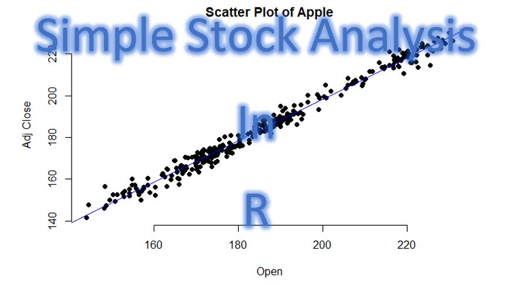

[![Contributors][contributors-shield]][contributors-url]
[![Forks][forks-shield]][forks-url]
[![Stargazers][stars-shield]][stars-url]
[![Issues][issues-shield]][issues-url]
[![MIT License][license-shield]][license-url]
[![LinkedIn][linkedin-shield]][linkedin-url]  

   

<!-- MARKDOWN LINKS & IMAGES -->
<!-- https://www.markdownguide.org/basic-syntax/#reference-style-links -->
[contributors-shield]: https://img.shields.io/github/contributors/LastAncientOne/SimpleStockAnalysisR.svg?style=for-the-badge
[contributors-url]: https://github.com/LastAncientOne/SimpleStockAnalysisR/graphs/contributors
[forks-shield]: https://img.shields.io/github/forks/LastAncientOne/SimpleStockAnalysisR.svg?style=for-the-badge
[forks-url]: https://github.com/LastAncientOne/SimpleStockAnalysisR/network/members
[stars-shield]: https://img.shields.io/github/stars/LastAncientOne/SimpleStockAnalysisR.svg?style=for-the-badge
[stars-url]: https://github.com/LastAncientOne/SimpleStockAnalysisR/stargazers
[issues-shield]: https://img.shields.io/github/issues/LastAncientOne/SimpleStockAnalysisR.svg?style=for-the-badge
[issues-url]: https://github.com/LastAncientOne/SimpleStockAnalysisR/issues
[license-shield]: https://img.shields.io/github/license/LastAncientOne/SimpleStockAnalysisR.svg?style=for-the-badge
[license-url]: LICENSE  
[linkedin-shield]: https://img.shields.io/badge/-LinkedIn-black.svg?style=for-the-badge&logo=linkedin&colorB=555
[linkedin-url]: https://linkedin.com/in/tin-hang

# Simple Stock Analysis in R  

This is tutorial for "Simple Stock Analysis in R." It is very simple and easy to understand for beginners that wants to learn about stock analysis and wants to become a quant. In addition, this tutorial for people that want to learn R language for stock analysis. 

## Prerequistes  
R   
RStudio - Use R Notebook    
Jupyter Notebook - Use R in Jupyter  

### Download Langauge and Software  
https://www.r-project.org/    
https://www.rstudio.com/  
https://www.spyder-ide.org/

<h3 align="left"> Programming Language:</h3>

  </a>  
  

<h3 align="left"> Software:</h3>

  </a>  <a href="https://www.spyder-ide.org/" target="_blank">  
  

## Dependencies
quantmod  

## List of the questions for simple stock tutorial in R:
______________________________________________________________________________________________________________________________
  1. How to get data from quantmod, yahoo, or other sites?
  2. How to manipulate data in dataframe or array?
  2. How to analyze the Historical stock data?
  3. How to plot data in different type visualization?
______________________________________________________________________________________________________________________________

## See the preview of my tutorial
### Paste the address on the website
https://htmlpreview.github.io/  # For html view

https://nbviewer.jupyter.org/ # For jupyter view

  

## Authors  
* Tin Hang  

## I will add more.
## I hope you enjoy learning this simple tutorial in R.

## Disclaimer
&#x1F53B; Do not use this code for investing or trading in the stock market. However, if you are interest in the stock market, you should read books &#x1F4D8; &#x1F4D7; &#x1F4D9; that are relate to stock market or finance.  

## This is not get rich quick and is for researching and educational purposes.
